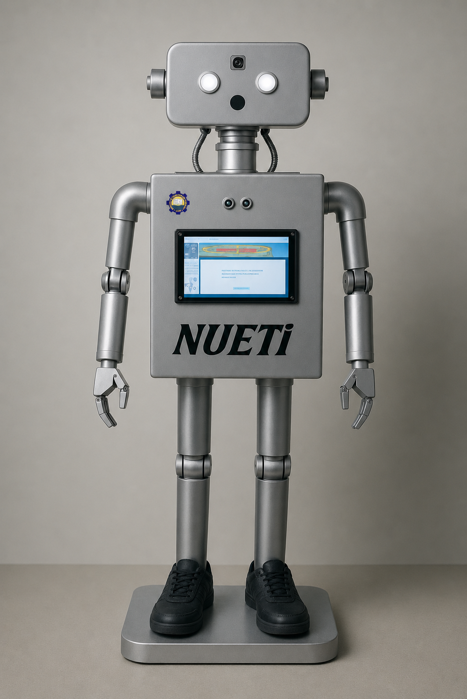

# 🤖 Humanoid Tripod Robo-Receptionist

> Final Year Project — B.Sc. Electrical Engineering  
> University of Engineering and Technology (UET), Lahore | May 2024

---

## 📸 Project Demo



---

## 📋 Project Overview

A Raspberry Pi-based humanoid receptionist robot capable of **face recognition**, **voice interaction**, **chatbot responses**, and **map-based navigation guidance**. Designed to serve as a stationary assistant in institutional environments like universities and hospitals.

---

## ✨ Key Features

- 🎤 **Speech Recognition** — Processes voice commands in real-time
- 👤 **Face Recognition** — Identifies and greets registered users via OpenCV
- 🤖 **Chatbot** — Answers queries using ChatterBot conversational engine
- 🗺️ **Navigation System** — Indoor/outdoor guidance with map-based directions
- 📺 **Touchscreen GUI** — Intuitive Tkinter interface on HDMI display
- 🔊 **Voice Output** — Text-to-speech responses via Pyttsx3
- 📊 **Visitor Logging** — Records visitor data in Excel sheets
- 🦾 **Servo Motion** — Neck joint servo for physical gestures

---

## 🗂️ Repository Structure

```
humanoid-robo-receptionist/
│
├── core/
│   ├── GUI.py                    # Main touchscreen GUI (Tkinter)
│   ├── chatbot.py                # ChatterBot conversational engine
│   ├── detection.py              # Face detection logic
│   ├── enable_auto_detection.py  # Auto face detection trigger
│   ├── face_recognition_model    # Trained face recognition model
│   ├── reco.py                   # Face recognition module
│   ├── training.py               # Model training script
│   └── voices.py                 # Pyttsx3 voice output module
│
├── ui/
│   ├── design.py                 # UI design components
│   ├── guiat.py                  # GUI utilities
│   ├── query_section.py          # Query handling UI
│   ├── FeedBack.py               # Feedback screen
│   └── User_Guide.py             # On-screen user guide
│
├── navigation/
│   ├── graph.py                  # Navigation graph/map logic
│   ├── nhug.py                   # Navigation helper
│   └── ask.py                    # Direction query handler
│
├── data/
│   ├── attendance.xlsx           # Visitor attendance log
│   ├── visitor_info.xlsx         # Visitor information records
│   ├── user_feedback.txt         # Collected user feedback
│   ├── database.sqlite3          # Main database
│   ├── db.sqlite3                # ChatterBot training database
│   ├── dataset.py                # Dataset management
│   ├── labels.pickle             # Face recognition labels
│   └── haarcascade_frontalface_default.xml  # OpenCV face cascade
│
├── models/
│   ├── Final face model          # Final trained face model
│   └── try1.py                   # Model testing script
│
├── assets/
│   ├── robo.png                  # Robot UI image
│   ├── uet.png                   # UET logo
│   ├── uni1.png                  # University banner
│   └── test.py                   # Component test scripts
│
├── docs/
│   ├── robot.png                 # Robot photo
│   └── User_Manual.pdf           # Complete project user manual
│
├── requirements.txt              # Python dependencies
└── README.md
```

---

## 🛠️ Tech Stack

| Category | Technology |
|---|---|
| **Hardware** | Raspberry Pi 4 (4GB), Pi Camera 8MP, HC-SR04 Ultrasonic Sensor |
| **Actuator** | Neck Joint Servo MG945 |
| **Display** | HDMI Pi Touchscreen |
| **Audio** | USB Microphone, 3.5mm Speaker |
| **Language** | Python 3.9 (Raspberry Pi), Python 3.11.7 (Development) |
| **GUI** | Tkinter, Tkimage |
| **Vision** | OpenCV, OpenCV-contrib |
| **Speech** | SpeechRecognition, Pyttsx3 |
| **AI/ML** | Scikit-learn, Spacy, ChatterBot |
| **Data** | Pandas, Openpyxl, SQLite3 |

---

## ⚙️ Installation & Setup

### Hardware Requirements
- Raspberry Pi 4 (4GB RAM)
- Pi Camera Module V2 (8MP)
- HC-SR04 Ultrasonic Sensor
- MG945 Neck Joint Servo
- HDMI Touchscreen Display
- USB Microphone + Speaker
- 32GB SD Card

### Software Setup

```bash
# Update system
sudo apt update
sudo apt install python3-pip

# Install core libraries
sudo pip3 install opencv-python
sudo pip3 install opencv-contrib-python
sudo pip3 install SpeechRecognition
sudo pip3 install pyttsx3
sudo pip3 install chatterbot chatterbot-corpus
sudo pip3 install pandas openpyxl
sudo pip3 install scikit-learn spacy
sudo pip3 install Pillow
```

### Run the Application

```bash
# Navigate to project directory
cd humanoid-robo-receptionist

# Run main application (use Thonny editor on Raspberry Pi OS)
python3 GUI.py
```

> **Note:** Run on Thonny editor in Raspberry Pi OS for best compatibility. Python 3.9 recommended on Raspberry Pi.

---

## 📐 System Architecture

```
Input/Output Layer          Processing Layer           UI Layer
──────────────────    ──────────────────────────    ────────────
  Pi Camera         →   Face Recognition            User Guide
  Microphone        →   Speech Recognition    →     Query Section
  Touchscreen       ←   Voice Output (TTS)          Navigation
  Speaker           ←   Chatbot Responses           Feedback
                        Navigation Processing        Auto Detection
                              ↕
                    Raspberry Pi 4 Core
                              ↕
                    Data Storage (SD Card)
                    SQLite3 | Excel | Pickle
```

---

## 👥 Team

| Name | ID | Role |
|---|---|---|
| **Tahir Abbas** | 2020-EE-629 | Lead Developer |
| **Zubair Usman** | 2020-EE-630 | Hardware & Integration |
| **Shahroz Khalid** | 2020-EE-621 | Software & Testing |

**Supervisor:** Engr. Osama Bin Naeem — Lecturer, Dept. of Electrical Engineering, UET Lahore

---

## 📄 Documentation

Full user manual available in [`docs/User_Manual.pdf`](docs/User_Manual.pdf)

---

## 📬 Contact

**Tahir Abbas**  
📧 ee.tahirabbas@gmail.com  
📞 +92 324 0654306
